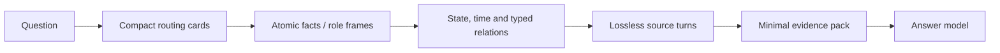
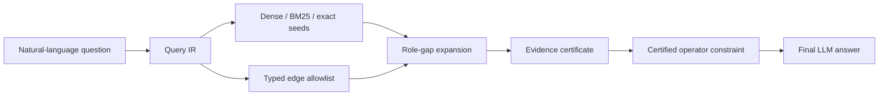

# GraphMem 与 Mem0 综合对比报告

日期：2026-08-04  
报告口径：LongMemEval 以 GraphMem V2 persistent evidence ledger 为主线；LoCoMo 补充 GraphMem V3.4 lossless-first 的完整结果。两方 judge 均通过 Mem0 `memory-benchmarks` 官方仓库运行。日志中的 prompt hash/commit 仅作为运行元数据，不作为判断 judge 是否相同的依据。

## 1. 执行摘要

GraphMem 的主要价值不是“保存更多文本”，而是把长期记忆组织成一个可复用、可逐层导航、可回溯原文的外部记忆世界，并用 Query IR 将检索约束为“寻找回答所需的最小完备证据子图”。在现有已冻结实验中：

- LongMemEval：GraphMem V2 ledger + GPT-5.4-mini 回答达到 **445/500，89.00%**；Mem0 为 **351/500，70.20%**。同题、同官方 judge 流程下，GraphMem 提高 **18.80 个百分点，多答对 94 题**。
- LoCoMo：将附件 Mem0 的 `convN_qM` 与 GraphMem 的 `locomoNN_MMMM` 逐题对齐后，Category 1–4 完整交集正好为 **1,540题，缺失0题**。GraphMem V3.4 为 **1328/1540，86.23%**，Mem0 为 **1215/1540，78.90%**，GraphMem 提高 **7.34个百分点、净多答对113题**。配对 bootstrap 的95%区间约为 **+4.94至+9.68 pp**，McNemar 双侧精确检验 `p=3.82e-9`。附件 Mem0 原始的 1331/1986（67.02%）还包含446道Category 5，不应作为主比较分母。
- Token：GraphMem 的 memory-backbone 开支可以完整审计。LongMemEval 构建平均 **254.5K token/份 memory**，查询回答平均 **7.03K token/题**；LoCoMo 10 组 conversation 总构建 **1.324M token**，V3.4 查询平均 **4.41K token/题**。Mem0 附件只保存答案和 judge usage，没有暴露 memory ingestion、search、answer 的 cached input、uncached input 和 output，因此目前不能进行数值化的 GraphMem–Mem0 memory-stage token 对比。
- 两项核心创新分别是 **Hierarchical Navigable Memory World（HNMW）** 与 **Graph Harness Query IR**。前者通过“一次构建、多题复用、粗到细展开、lossless provenance”降低重复上下文；后者通过实体、关系、时间、范围、required roles 和 provenance certificate 提高证据精度与完整度。

## 2. 评测口径与公平性

### 2.1 可以直接比较的结果

| Benchmark | GraphMem | Mem0 | 可比性 |
|---|---:|---:|---|
| LongMemEval 500题 | 445/500，89.00% | 351/500，70.20% | 严格配对：同题、同官方仓库 judge 流程 |
| LoCoMo Category 1–4 | V3.4 1328/1540，86.23% | 1215/1540，78.90% | 严格配对：ID完整对齐，缺失0题 |
| LoCoMo 附件配对子集 | V2 159/299，53.18% | 225/299，75.25% | 严格配对，但不是完整全集，不能外推 |

### 2.2 只能作为系统级参考的结果

| 结果 | 评分范围 | 准确率 | 说明 |
|---|---:|---:|---|
| GraphMem V2 LoCoMo | Category 1–4，1540题 | 72.01% | 早期状态图方案 |
| GraphMem V3.4 LoCoMo | Category 1–4，1540题 | 86.23% | lossless-first 导航完整结果 |
| 附件 Mem0 LoCoMo 原始汇总 | 全部1986题 | 67.02% | 含Category 5；重新过滤后主结果为1215/1540，78.90% |

所有 judge 均来自 Mem0 `memory-benchmarks` 官方仓库。由于不同导出产物中的 prompt hash、commit 或模型标签可能记录方式不同，本报告不使用这些哈希判断 judge 身份；真正决定可比性的是题目集合、评分范围、答案模型和 judge 执行流程。

## 3. 准确率对比

### 3.1 LongMemEval：GraphMem V2 相对 Mem0

| 题型 | GraphMem V2 | Mem0 | 差值 |
|---|---:|---:|---:|
| knowledge-update | 68/78，87.18% | 62/78，79.49% | +7.69 pp |
| multi-session | 118/133，88.72% | 91/133，68.42% | +20.30 pp |
| single-session-assistant | 54/56，96.43% | 48/56，85.71% | +10.71 pp |
| single-session-preference | 28/30，93.33% | 29/30，96.67% | -3.33 pp |
| single-session-user | 66/70，94.29% | 65/70，92.86% | +1.43 pp |
| temporal-reasoning | 111/133，83.46% | 56/133，42.11% | +41.35 pp |
| **Overall** | **445/500，89.00%** | **351/500，70.20%** | **+18.80 pp** |

配对分解为：两者都正确 316 题、仅 GraphMem 正确 129 题、仅 Mem0 正确 35 题、两者都错误 20 题。GraphMem 的优势主要集中在时间推理、跨会话组合和 assistant 提供事实，这与状态链、时间端点和 source-linked evidence assembly 的设计目标一致。偏好题略低 3.33 pp，说明图结构并非所有类型上都天然占优。

这里的 18.80 pp 是完整系统的端到端差异，包含索引、召回、operator、evidence packing 和回答 prompt；不能把全部提升单独归因于某一图边或 Query IR 模块。

### 3.2 LoCoMo：从 V2 缺陷到 V3.4 改进

| Category | GraphMem V2 | GraphMem V3.4 | 改进 |
|---:|---:|---:|---:|
| 1 | 195/282，69.15% | 235/282，83.33% | +14.18 pp |
| 2 | 210/321，65.42% | 259/321，80.69% | +15.27 pp |
| 3 | 48/96，50.00% | 55/96，57.29% | +7.29 pp |
| 4 | 656/841，78.00% | 779/841，92.63% | +14.63 pp |
| **Category 1–4** | **1109/1540，72.01%** | **1328/1540，86.23%** | **+14.22 pp，+219题** |

V2 在 LoCoMo 上的核心缺陷并非粗粒度 session 完全找不到，而是：双人对话的 speaker/owner 归属、问答相邻轮次、指代链以及最终 source turn 没有完整进入回答上下文。V3.4 采用 speaker-neutral 的 lossless-first 导航，先检索原始 turn，再结合邻接与图关系形成局部 closure，因此最终 raw-leaf evidence recall 达到 75.78%。证据全部进入 prompt 的题目准确率为 90.81%，部分证据为 81.44%，无支持证据时仅 55.70%，说明 LoCoMo 的剩余误差仍高度受 evidence completeness 支配。

### 3.3 LoCoMo：GraphMem V3.4 相对 Mem0 的同题对比

附件 Mem0 的逐题ID采用 `convN_qM`，GraphMem采用 `locomoNN_MMMM`。依据仓库的LoCoMo转换规则进行确定性规范化后，两者在Category 1–4的交集为完整1,540题，GraphMem侧缺失0题。重新聚合结果如下：

| Category | GraphMem V3.4 | Mem0 | 差值 |
|---:|---:|---:|---:|
| 1 | 235/282，83.33% | 186/282，65.96% | +17.38 pp |
| 2 | 259/321，80.69% | 269/321，83.80% | -3.12 pp |
| 3 | 55/96，57.29% | 63/96，65.63% | -8.33 pp |
| 4 | 779/841，92.63% | 697/841，82.88% | +9.75 pp |
| **Category 1–4** | **1328/1540，86.23%** | **1215/1540，78.90%** | **+7.34 pp** |

配对结果为：两者都正确1,088题，仅GraphMem正确240题，仅Mem0正确127题，两者都错误85题。因此净优势为113题。以固定种子 `20260804` 对1,540个配对差值进行bootstrap，95%区间约为+4.94至+9.68 pp；McNemar双侧精确检验 `p=3.82e-9`，差异并非由少数随机翻转造成。

Category 2和3仍由Mem0领先，说明GraphMem的总体优势主要来自Category 1的对话事实定位以及Category 4的高覆盖检索；复杂多跳Category 3仍是明确短板。附件原始Mem0的446道Category 5为116/446（26.01%），这正是其全1986题汇总下降到67.02%的原因。官方Category 1–4比较必须使用78.90%，不能继续引用67.02%作为同分母对照。

## 4. Memory-backbone Token 开支

Token 只统计 memory 构建以及检索/回答阶段的 backbone 调用；embedding 与 judge 均排除。cached input、uncached input 和 output 分开记录。

### 4.1 LongMemEval

GraphMem 89% 版本复用了已经构建的 V2 persistent evidence ledger，因此“构建”和“GPT-5.4-mini 重答”来自两个可审计但不同时间的冻结阶段：构建采用 canonical V2 历史运行，查询采用当前 89% GPT 版本。它们适合描述系统成本，不应伪装成一次从零开始的同模型端到端重跑。

| 阶段 | Uncached input | Cached input | Output | Total | 单题统计 |
|---|---:|---:|---:|---:|---|
| V2 索引构建 | 63,056,006 | 18,749,824 | 45,446,463 | 127,252,293 | mean 254,505；P50 253,946；P95 271,194；max 284,693 |
| GPT 查询回答 | 2,713,852 | 790,016 | 11,695 | 3,515,563 | mean 7,031；P50 7,020；P95 8,000；max 8,725 |
| 合计 | 65,769,858 | 19,539,840 | 45,458,158 | 130,767,856 | 每份 memory + 一次查询平均 261,536 |

LongMemEval 每题对应独立 memory，因此高构建成本无法跨题摊销；其价值主要体现在把回答工作集稳定控制在 9K token 内。首次索引并不便宜，这是 GraphMem 当前最明确的成本边界。

### 4.2 LoCoMo

LoCoMo 的 10 组 conversation 各构建一次，同一个索引回答 1,986 个问题。V3 图构建与 V3.4 lossless-first 查询的统计如下：

| 阶段 | Uncached input | Cached input | Output | Total | 分布 |
|---|---:|---:|---:|---:|---|
| 10组 conversation 构建 | 772,479 | 4,864 | 546,158 | 1,323,501 | 每组 mean 132,350；P50 139,922；P95/max 150,802 |
| 1,986题查询回答 | 6,430,303 | 2,077,952 | 255,655 | 8,763,910 | 每题 mean 4,413；P50 4,405；P95 5,055；max 5,834 |
| 构建+查询 | 7,202,782 | 2,082,816 | 801,813 | 10,087,411 | 摊销后每题 5,079 |

构建摊销仅为 666 token/题。该结果体现了持久化记忆的经济性：conversation 越被反复查询，一次构建的固定成本越容易摊薄。

### 4.3 Mem0 Token 为什么暂不能给出数值

用户提供的 Mem0 压缩包包含答案与 judge token，但没有 memory ingestion、search 和 answer backbone 的逐调用 token ledger；本地 `memory-benchmarks` 结果也未填充可用于重建 cached input、uncached input、output 的字段。因此：

- 可以比较准确率；
- 可以报告 GraphMem 的构建与查询成本；
- 不能把 Mem0 judge token 当成 Mem0 构建或回答 token；
- 不能在缺失数据时宣称 GraphMem 相对 Mem0 节省了具体百分比。

要完成严格成本对照，需要对 Mem0 的 `add/search/answer` 调用增加 usage interceptor，在同样的 500/1,986 题上重新运行，并按 memory ID 区分一次性构建与每题查询。缓存拆分缺失时，应把全部 prompt token 归入 uncached 并标注 inferred。

## 5. 创新一：Hierarchical Navigable Memory World

HNMW 将长期对话变成一个持久化、可导航、可回溯的记忆世界，而不是不可验证的一段摘要。



它包含三个关键性质：

1. **Hierarchical**：粗层只定位记忆区域，细层表达实体、事件、状态、数量与关系，原始 turn 只在证据展开时读取。
2. **Navigable**：系统既能从卡片向下展开，也能沿 `state_transition`、`before/after`、`dialogue_pair`、`reference` 等有类型关系横向补证。
3. **Lossless and reusable**：所有事实和关系保留 source provenance；索引构建一次后可服务多次查询。

### 具体例子：状态更新与 Token 节省

假设一段长期记忆中先出现“周一计划坐火车去上海”，后续出现“周三取消火车票，改订周四航班”。问题是“现在准备如何去上海？”

- 普通全文方案需要把多段旅行对话重新送给模型，且可能被旧的“火车计划”误导。
- HNMW 先用 routing card 定位旅行相关 session，再读取两个状态 frame；沿 state transition 得到 `train: planned → cancelled` 与 `flight: booked`，最后展开两条 source turn 核验。
- 回答上下文只包含当前状态、被替代状态、变更时间和短原文，而不是全部 transcript。

这个机制解释了 LongMemEval 时间推理相对 Mem0 的大幅提升，也解释了 LoCoMo 为什么能够将 10 组 conversation 的构建成本在 1,986 个问题间复用。它降低的是重复读取和重复推理，不是让第一次索引零成本。

## 6. 创新二：Graph Harness Query IR

Graph Harness Query IR 是**在线、逐问题执行**的查询控制层。离线 HNMW 构建完全独立于问题，不读取问题、gold answer 或 gold session ID；当一个新问题到达时，Graph Harness 才把它编译为 evidence contract，并在已经持久化的 memory world 上执行。确定性的 Query IR 编译、多路检索、图遍历、证书校验和 operator 都是本地计算，不消耗 LLM token；只有证据仍不完整时的一次可选短 planner，以及最终回答调用，计入 question-time backbone token。

从系统分工看，Graph Harness 不是图本身，也不是又一个 embedding retriever，而是图上的在线 control plane：它同时承担 compiler（问题到证据角色）、orchestrator（协调 dense/BM25/exact/倒排/图边）、verifier（entity/relation/scope/provenance 四项证书）和 governor（边 allowlist、深度、停止条件与 token 预算）四项职责。

仅有分层图仍可能出现“找到了正确 session，却没有拿齐答案所需角色”。Graph Harness Query IR 将自然语言问题编译为一个可执行的证据契约：

```text
target entities / owner / speaker
target relation and requested value type
temporal, state and collection constraints
required evidence roles
scope and polarity
allowed graph relations and answer algebra
```

随后，dense、BM25、exact match 和倒排索引只负责产生候选；Query IR 决定允许沿哪些边扩展、缺少什么角色、何时停止，并用 entity、relation、scope、provenance 四项 certificate 验证证据。



### 具体例子一：时间比较

问题“活动 A 比活动 B 早多少天？”需要的不是更多相似句子，而是 `{event A, time A, event B, time B, source}`。Query IR 将这五项设为 required roles：

- dense/BM25 找到 A 后，如果 B 的时间缺失，系统只能沿 `same_event/reference/temporal_endpoint/source` 补证；
- participant 或 theme 这类宽 hub 不允许无条件扩散；
- 日期差 operator 只有在实体、关系、时间范围和 provenance 全部通过后才输出约束；
- 最终 LLM 负责自然语言表述，但不能改写已经认证的日期差。

这避免了“只召回一个时间端点仍让模型猜”的常见错误。

### 具体例子二：双人对话问答

假设 A 问“你最后买了什么礼物？”，B 回答“蓝色马克杯”，稍后又说“已经送出去了”。问题问“B 买了什么？”Query IR 要求 `{speaker B, purchase relation, object, reply/source}`：

- 初始命中“礼物”后，沿 `dialogue_pair/next_turn/source` 同时取回问题与回复；
- `speaker/owner` certificate 阻止把 A 的偏好误当成 B 的购买；
- 邻接 closure 补入“已经送出”只用于状态/时间确认，不替换核心 object。

这正是 V3.4 在 LoCoMo 上强化的路径：粗定位不再被视为证据完整，系统必须把对话角色和原始回复一起送入回答模型。

## 7. 两项创新如何协同

HNMW 解决“在哪里找、如何少读、如何复用”；Graph Harness Query IR 解决“需要找齐什么、允许怎么走、怎样证明证据足够”。二者缺一不可：

- 只有 HNMW：可能找到正确 session，但少了旧状态、第二个时间端点或真正的回复 turn。
- 只有 Query IR：可以定义完备证据，却仍需在完整 transcript 中高成本搜索。
- 二者结合：构造满足 required roles 的最小完备证据子图，并在完整后立即停止扩展。

现有数据支持这种组合方向，但尚不是完整的单模块因果证明。论文级验证应在相同索引、相同问题、相同答案模型上依次消融：dense+BM25；加 typed edge；加 Query IR allowlist；加 role-gap expansion；加 certificate；同时报告准确率、evidence recall、无效扩展数和 token。

## 8. 当前局限与可发布结论

### 可以发布

- LongMemEval 同题、同官方 judge 流程下，GraphMem V2 ledger 为 89.00%，Mem0 为 70.20%，提升 18.80 pp。
- LoCoMo同一Category 1–4的1,540题上，GraphMem V3.4为86.23%，Mem0为78.90%，提升7.34 pp；GraphMem净多答对113题。
- GraphMem LongMemEval 查询平均 7.03K token；LoCoMo 查询平均 4.41K，构建摊销后总平均 5.08K。
- 所有 GraphMem token 均可拆分 cached input、uncached input 与 output，judge/embedding 不混入 memory 预算。
- HNMW 与 Query IR 分别针对 token efficiency 和 evidence precision/completeness，并有逐层证据审计支持。

### 暂不应发布为严格结论

- “GraphMem 在 LoCoMo 领先 Mem0 19.21 pp”：这是86.23%与包含Category 5的67.02%错配；正确同题差值为7.34 pp。
- “GraphMem 比 Mem0 节省 X% token”：缺少 Mem0 memory ingestion/search/answer usage。
- “18.80 pp 全部由 Query IR 带来”：这是完整 GraphMem 系统差异，尚需固定索引的模块消融。
- “GraphMem 首次构建很便宜”：LongMemEval 首次构建平均约254.5K token，优势主要来自查询工作集约束和多查询摊销。

## 9. 可复现产物

- LongMemEval 89% GraphMem：`runs/v3_7_hybrid_20260730/lme500_v2ledger_gpt54mini/`
- LongMemEval canonical V2 构建统计：`docs/graphmem_v2_final_500_report_20260725.md`
- LoCoMo V2：`runs/locomo10_v2_sharded4_20260725/`
- LoCoMo V3.4：`runs/v3_full_20260727/locomo_full1986_lossless_nav_v34/`
- LoCoMo V3/V3.4 构建索引：`runs/v3_full_20260727/locomo_full1986_base/hierarchical_hypergraph_v3/`
- 早期详细方法与日志审计：`docs/graphmem_v2_gpt_mem0_comparison_report_20260804.md`

## 10. 建议补充的最终对照实验

为了把这份工程报告升级为严格论文结果，仍需补两个缺口：

1. 为 Mem0 的 `add/search/answer` 增加 token interceptor，在完全相同模型、题目和缓存策略下重跑，分别报告构建与查询的 cached input、uncached input、output、P50/P95/max。
2. 在相同索引和回答模型下执行 Graph Harness 逐模块消融，给出 HNMW、typed expansion、Query IR 和 certificate 各自的独立增益。

完成后即可形成真正对称的“准确率—构建成本—查询成本”三维比较。
