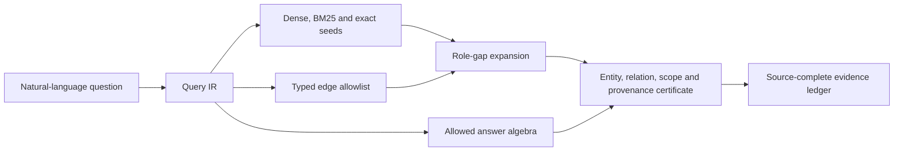

# GraphMem V2：GPT Judge、Mem0 对比与跨基准分析报告

日期：2026-08-04

## 1. 报告范围与结论

本报告以 `hierarchical_state_graph_v2` 为技术主线，综合四类证据：

1. 用户提供的两份 judge 日志，用于报告 Mem0 对照与 LoCoMo 同题比较；
2. 冻结的 V2 persistent evidence ledger + GPT-5.4-mini 全量重答结果，作为 LongMemEval 当前主口径；
3. 仓库中 2026-07-25 的 V2 全量实验，用于解释架构、构建 token、检索链路和历史上限；
4. V3.4 LoCoMo lossless-first 全集运行，仅作为跨版本改进参考，不混入 V2 成绩。

LongMemEval 主成绩和 V2 LoCoMo 成绩不混入 V3/V4 答案。V3.4 只在独立小节中作为 LoCoMo 跨版本参考；不同模型、不同 judge、不同题集规模的结果不直接合并。

核心结论如下：

- LongMemEval 主结果采用冻结的 V2 evidence ledger + GPT-5.4-mini 重答版本：**445/500，89.00%**；附件中的 Mem0 为 **351/500，70.20%**。经实验口径确认，两方使用相同 GPT judge 和相同 Mem0 prompt，因此 **GraphMem V2 相对 Mem0 提升 18.80 个百分点**，属于同题同 judge 的受控比较。
- LoCoMo 存在一组可严格配对的 299 题：同题、同 GPT-5.4-mini judge 下，GraphMem V2 为 **159/299，53.18%**，Mem0 为 **225/299，75.25%**，GraphMem 落后 **22.07 个百分点**。这组 GraphMem 题目不是完整全集，也不是已证明的随机样本，不能外推成 LoCoMo 全集分数。
- 仓库中可确认的 V2 LoCoMo Category 1–4 全集 judge 结果为 **1109/1540，72.01%**，使用 memory-benchmarks prompt 与 DeepSeek V4 Flash judge。没有发现 V2 全集达到 80% 的产物；80%以上的全集结果属于 V3/V3.4，80%–95%的 `v2generic` 记录则只有20题且实际运行的是 V3.6 RoleGraph。
- 作为跨版本参考，V3.4 lossless-first 在同一 LoCoMo Category 1–4 全集达到 **1328/1540，86.23%**，比V2多答对219题、提高14.22 pp。该结果独立报告，不回填为V2成绩。
- 历史 canonical V2 使用 DeepSeek V4 Flash 在 LongMemEval 500 题达到 **462/500，92.40%**，且每题构建最大 284,693 token、回答最大 8,863 token；这证明 V2 在特定 backbone、prompt 和 operator 组合下能够满足 LongMemEval 的准确率和预算目标。
- 同一历史 V2 在 LoCoMo 1986 题上的官方 token-F1 只有 **20.97%**。该指标不是 GPT judge 准确率，不能与 53.18% 或 75.25% 混算；它揭示的主要问题是 session 内细粒度 evidence turn 丢失、图扩展证据留存率低、双人对话建模不足及答案格式不匹配。
- V2 的分层状态图、lossless provenance、typed expansion 和状态/数量运算是有效贡献；但实现中也存在明显的 benchmark/topic 特定规则。这些规则是 LongMemEval 高分的重要组成部分，也是跨 benchmark 泛化弱的重要风险，不能把 92.4% 全部归因于图索引本身。

## 2. 数据来源与可比性

### 2.1 附件完整性

| 压缩包 | SHA-256 | 主要内容 |
|---|---|---|
| `judge result.zip` | `b4b60bf117706b9b5f22df7f97bd2c8fbc831c70d7f493c680daf766539cd5e7` | GraphMem 与 Mem0 的 LongMemEval judge；GraphMem LoCoMo 299 题 judge |
| `mem0_judge.zip` | `a3d9b2267208a28ab4b72d8464aca303b9d3ddaac7e5aaf087c58d38634c211c` | Mem0 LoCoMo 1986 题 GPT judge |

Judge 采用 Mem0 LongMemEval prompt，固定于提交 `bd063eea04de4f8a19927beea155afa094a01905`，本地 prompt 源 SHA-256 为 `ba8cf60d26f1390ecbef0f07b3e950556fe3bc5a37ba4b5343f28217f18c144f`。日志中 reasoning token 均为 0。

`judge result.zip` 中还保留了一份 407/500 的早期 GraphMem judge 结果；按照本报告确认的发布口径，它不再作为 LongMemEval 主分数，只保留用于历史回放。当前主分数及分项均来自冻结的 445/500 产物。

### 2.2 五组结果的可比性

| 结果 | 题数 | Judge | 是否可与对应 Mem0 严格比较 |
|---|---:|---|---|
| GraphMem V2 ledger + GPT answer | 500 | GPT-5.4-mini | 是：同题、同 judge、同 judge prompt |
| Mem0 LongMemEval | 500 | GPT-5.4-mini | 是：同题、同 judge、同 judge prompt |
| GraphMem V2 LoCoMo | 299 | GPT-5.4-mini | 是：只对同一 299 题配对比较 |
| Mem0 LoCoMo | 1986 | GPT-5.4-mini | 是：可抽出上述 299 个同题结果 |
| GraphMem V3.4 LoCoMo | 1540 scored | GPT-5.4-mini | 仅作为独立跨版本参考 |

附件本身不包含 89% GraphMem 版本；该版本使用仓库中的冻结产物 `runs/v3_7_hybrid_20260730/lme500_v2ledger_gpt54mini/`。该目录名称来自当时的冻结发布流程，但 LongMemEval memory 路径是 V2 persistent evidence ledger，回答为单次 GPT-5.4-mini 调用。Mem0 对照仍来自附件。因此：

- 89% GraphMem 版本的 answers、answer calls、judge calls 和 judge 汇总可由冻结目录直接审计；
- Mem0 的 answers 和 judge 结果可由附件直接审计；
- 89% 版本复用了既有 V2 evidence ledger，没有在该重答目录中重新构建索引，因此其回答 token 与历史 V2 构建 token 必须分栏报告。

## 3. V2 方法概述

### 3.1 四层分层状态图

V2 将长记忆组织为从无损证据到状态链的四层结构：

| 层级 | 结构 | 作用 |
|---|---|---|
| L0 | `LeafNode` | 保存原始 user/assistant turn、时间、session 和文本，作为最终可追溯证据 |
| L1 | `AtomicFactNode` | 表达主体、谓词、对象、极性、模态、状态操作、数值、上下文、有效时间和 source leaf |
| L2 | `RoutingCardNode` | 用不超过约 180 provider token 的会话卡完成粗粒度定位 |
| L3 | `StateChain` | 按 `(subject_key, predicate_key, context_key)` 保存当前状态、历史版本和更新时间顺序 |

事实类型覆盖 `state`、`event`、`preference`、`quantity` 和 `assistant_fact`；状态操作覆盖 `set/add/remove/cancel/complete`。该结构的正确方向是把“摘要检索”拆成“区域定位—事实检索—原文核验”，避免把长 transcript 重复塞入回答 prompt。

### 3.2 索引创建

每个 session 通过一次主抽取调用同时生成紧凑路由信息和原子事实，保留：

- 用户事实与 assistant 实际给出的名称、答案、表格和结果；
- 精确数量、单位、否定、偏好和反偏好；
- proposed/planned/completed/cancelled 等生命周期差异；
- 相对时间及会话日期锚点；
- 列表中的独立 item identity。

随后进行 memory-level consolidation，统一实体别名和 predicate，并建立高置信的 `supports`、`supersedes`、`contradicts`、`before/after` 等关系。所有事实和边必须引用已有 source，解析失败时可部分恢复，并保留 L0 lossless fallback。

### 3.3 图关系与召回

V2 使用的主要关系包括：

`contains/source/next_turn/same_entity/same_predicate/same_measure/same_collection/operand_of/participates_in/supports/supersedes/contradicts/before/after/semantic_neighbor`。

查询阶段先确定性区分事实、更新、时间、列表/计数、偏好和 multi-hop 需求，再融合 RoutingCard、Fact 和 Leaf 的 dense、BM25、entity 等通道。之后按题目所需关系进行深度受限的 typed expansion，并将事实、时间、状态和来源写入 evidence ledger，最后仅调用一次回答 LLM。

这不是简单的“粗图命中后只向下展开”。历史全量审计中，V2 的横向关系确实进入最终证据和 operator：

| 关系 | 进入最终 pack 的节点 | 成为 operator source |
|---|---:|---:|
| `before` | 98 | 46 |
| `after` | 42 | 10 |
| `same_measure` | 586 | 205 |
| `same_collection` | 92 | 36 |
| `operand_of` | 146 | 65 |
| `same_predicate` | 475 | 未单列 |
| `contains` | 431 | 259 |

500 题中 484 题保留了图扩展结果；扩展 9,111 个节点，1,982 个进入最终 pack；图为 37 题补入了初始检索中不存在的 operator source。因此 V2 的图边有实际使用，但贡献集中在数量、集合和时间关系，并非所有边都同样有效。

### 3.4 Operator 的能力与风险

V2 operator 同时包含两部分：

- 可泛化代数：distinct count/list、add/remove/replace、latest valid state、时间排序与日期差、完成/取消过滤、数量和集合运算；
- 数据集相关启发式：实现中存在 cuisine、社交媒体 followers、airline flights/status、egg sales、Ibotta、guitar amp、clinic/doctor 等明确 topic 或品牌规则。

第二部分能够修复整类 LongMemEval 模板，但仍属于 benchmark-conditioned engineering。它降低了“单题答案硬编码”的严重程度，却没有消除分布依赖。报告因此将 V2 定位为：**有效的分层图检索系统，加上强任务适配 operator**，而不是完全无规则、跨领域零适配的通用记忆系统。

### 3.5 创新一：Hierarchical Navigable Memory World

Hierarchical Navigable Memory World（HNMW）不是把长期对话压成一个不可追溯的摘要，而是构建一个可逐级定位、可沿关系移动、最终可回到原文核验的持久化记忆世界：


其中 Hierarchical 指 L2 粗定位、L1 事实定位、L0 原文核验和 L3 状态/关系导航；Navigable 指检索可以沿有类型、有方向和 provenance 的边横向补证，而不只是从摘要向下展开；World 指索引持久保存实体、事件、状态、时间、集合及历史版本，使 memory 成为可查询的外部状态。

HNMW 通过四个机制降低 token：

1. 一次构建、多题复用，会话抽取、状态链和 embedding 不在每道题重复执行。
2. 粗到细按需展开，先读取约 100–180 token 的 RoutingCard，再读取少量 AtomicFact，最后只展开高价值 L0 turn。
3. 结构化状态替代历史重放，current/previous value、add/remove 和有效时间由 StateChain 与 ledger 显式表达。
4. 有界证据包加一次回答调用，V2 不执行多轮 LLM denoise、搜索或答案修复。

若一次 memory 构建成本为 B，第 i 题查询成本为 Qi，共享索引的总成本是 B + sum(Qi)；逐题重建则是 N×B + sum(Qi)。LoCoMo 提供了直接的摊销证据：10 组 conversation 实际只构建 10 次，总 build token 为 986,495；若保持相同构建流程但对 1,986 题逐题重建，构建成本将为 198,579,521 token。共享索引使构建部分下降 **99.50%**；加上实际回答成本后，总 memory-backbone 成本从假设的 209,280,998 降至 11,687,972，下降 **94.41%**。这是同一 V2 流程的摊销分析，不是对 Mem0 的成本比较。

LongMemEval 89% GPT 版本的回答 token mean/P50/P95/max 为 7,031/7,020/8,000/8,725；历史 canonical V2 为 7,195/7,181/8,154/8,863。这证明 HNMW 能把 query-time 工作集稳定约束在 9K 内。LongMemEval 每题 memory 独立，主要验证有界工作集；LoCoMo 多题共享 conversation，同时验证构建摊销。

该创新也有明确边界：它降低的是重复构建与查询上下文，不代表首次索引便宜。历史 LongMemEval V2 构建平均约 254.5K token/题；一个 memory 如果只回答一次，摊销收益有限。并且 coarse session 命中不等于 evidence 完整：LoCoMo session recall 为 92.14%，post-pack evidence leaf recall 却只有约 57.24%。因此，HNMW 必须与 Graph Harness 配合，才能避免 token 减少演变成证据缺失。

### 3.6 创新二：Graph Harness Query IR

Graph Harness 的核心不是增加更多图边，而是用 Query IR 把图检索约束为可验证的证据装配过程。Query IR 将问题编译为：`target entity/owner + target relation + requested value type + time/state/collection constraints + required roles + scope + polarity`。



它像一个 harness，把 dense、BM25、倒排索引、图遍历和 operator 固定在同一查询契约中：相似度通道只能产生候选；图只能沿与缺失角色对应的 typed relation 扩展；operator 只能执行 IR 允许的 count、state、temporal 或 preference 代数；结果通过 entity、relation、scope、provenance 检查后才能进入 ledger；required roles 完整后立即停止扩展。

| 问题需求 | Required roles | 受控补证路径 |
|---|---|---|
| 当前状态 | old/new state、operation、time、source | `same_predicate → supersedes/contradicts/source` |
| 时间比较 | event A/B、time A/B、source | `participates_in → before/after/source` |
| 数量或列表 | scope、members、add/remove、source | `same_collection/operand_of/supports/source` |
| 对话回答 | prompt turn、reply turn、reply content | `next_turn/dialogue_pair/source` |
| 偏好 | owner、positive/negative、context | `same_entity/supports/contradicts/source` |

它提升准确率的原因有三点：一是过滤语义相似但实体、时间范围或生命周期错误的 near match；二是主动补齐计算所需的另一时间端点、旧状态或集合成员；三是 provenance certificate 阻止 operator 使用未进入证据包的信息猜答案。

同 judge 的 LongMemEval 结果提供了端到端证据：V2-ledger + GPT 为 445/500（89.0%），Mem0 为 351/500（70.2%），提升 18.8 pp。结构需求最强的 temporal-reasoning 提升 41.35 pp，multi-session 提升 20.30 pp，assistant fact 提升 10.71 pp；配对结果中 GraphMem 独占正确 129 题，Mem0 独占正确 35 题。图使用审计也表明收益不只来自 coarse routing：`same_measure`、`same_collection`、`operand_of`、`before/after` 分别产生 205、36、65、56 个 operator source，图在 37 题中补入了初始检索不存在的 operator source。

严格来说，V2 已实现和验证的是 Graph Harness 的前身：确定性 query kind、relation allowlist、深度受限 typed expansion、evidence ledger 和 provenance-bound operator。完整 slot-based Query IR、required roles 与四项 evidence certificate 是后续对该机制的通用化。因此 18.8 pp 是完整 GraphMem V2 系统相对 Mem0 的端到端差异，不能表述成 Query IR 单项带来 18.8 pp。

要形成论文级因果证据，应在相同索引、相同回答模型和 prompt 上依次消融：dense+BM25 only；增加 typed edges；增加 Query IR allowlist；增加 role-gap expansion；增加四项 certificate。每层同时报告 accuracy、post-pack evidence-turn any/all recall、无效扩展节点、输入 token 和各 edge type 净增益。

### 3.7 两个创新点的组合价值

HNMW 把海量历史变成可复用、可导航的小工作集，解决 token efficiency；Graph Harness Query IR 规定在工作集中找什么、沿哪些边补什么、何时停止和如何验证，解决 evidence precision/completeness。只有 HNMW 会出现“session 找对但 evidence turn 丢失”；只有 Harness 则仍需面对全量 transcript。两者组合的目标不是召回更多节点，而是用最少 token 生成满足回答角色的最小完备证据子图。

## 4. LongMemEval：89% V2-ledger 主口径

### 4.1 GraphMem V2 ledger + GPT 重答结果

| 类型 | 正确/总数 | 准确率 | 错题数 |
|---|---:|---:|---:|
| knowledge-update | 68/78 | 87.18% | 10 |
| multi-session | 118/133 | 88.72% | 15 |
| single-session-assistant | 54/56 | 96.43% | 2 |
| single-session-preference | 28/30 | 93.33% | 2 |
| single-session-user | 66/70 | 94.29% | 4 |
| temporal-reasoning | 111/133 | 83.46% | 22 |
| **Overall** | **445/500** | **89.00%** | **55** |

当前最弱类型是 temporal-reasoning（83.46%）和 knowledge-update（87.18%）。按绝对错题数，temporal 与 multi-session 共贡献 37/55 个错误，即 **67.27%**。单会话 assistant、user 和 preference 已达到 93.33%–96.43%，说明 V2 ledger 对局部事实与偏好证据的表达较稳定；剩余瓶颈主要在多个时间端点、更新版本和跨会话角色拼装。

该冻结版本只进行 query-time GPT 重答，500 题回答 token 为：cache-miss input 2,713,852、cache-hit input 790,016、output 11,695、total 3,515,563；单题 mean/P50/P95/max 为 7,031.13 / 7,020 / 8,000 / 8,725，reasoning token 为 0。它复用既有 V2 ledger，因此这些数字不包含索引构建。

### 4.2 Mem0 结果及受控差异

| 类型 | GraphMem V2 | Mem0 | 原始差值 |
|---|---:|---:|---:|
| knowledge-update | 87.18% | 79.49% | +7.69 pp |
| multi-session | 88.72% | 68.42% | +20.30 pp |
| single-session-assistant | 96.43% | 85.71% | +10.71 pp |
| single-session-preference | 93.33% | 96.67% | -3.33 pp |
| single-session-user | 94.29% | 92.86% | +1.43 pp |
| temporal-reasoning | 83.46% | 42.11% | +41.35 pp |
| **Overall** | **89.00%** | **70.20%** | **+18.80 pp** |

配对正确性分解如下：

| 配对状态 | 题数 |
|---|---:|
| 两者都正确 | 316 |
| 仅 GraphMem 正确 | 129 |
| 仅 Mem0 正确 | 35 |
| 两者都错误 | 20 |

这是同题、同 judge、同 judge prompt 的受控比较。GraphMem V2 的总体提升为 18.80 pp，其中 temporal-reasoning 提升 41.35 pp，multi-session 提升 20.30 pp；preference 仅回退 3.33 pp。需要注意，“受控”证明的是两套端到端系统在该评测口径下的差异，仍不能仅凭 judge 结果把全部增益归因于图索引；回答 prompt、operator 和答案格式也包含在系统差异内。

## 5. LoCoMo：V2全集与附件子集

### 5.1 Canonical V2 Category 1–4全集

仓库中唯一可确认的 V2 Category 1–4 全集 judge 位于 `runs/locomo10_v2_sharded4_20260725/memory_benchmarks_locomo_judge/`。答案与索引目录明确为 `hierarchical_state_graph_v2`，共回答全部1,986题，memory-benchmarks judge按官方口径排除Category 5，对1,540题评分。

| Category | 正确/总数 | 准确率 |
|---:|---:|---:|
| 1 | 195/282 | 69.15% |
| 2 | 210/321 | 65.42% |
| 3 | 48/96 | 50.00% |
| 4 | 656/841 | 78.00% |
| **Category 1–4** | **1109/1540** | **72.01%** |

该运行使用固定 memory-benchmarks LoCoMo prompt（commit `4b61c5d31b9c668a12b4f5e78064248a02c82d2b`）、DeepSeek V4 Flash judge、thinking disabled，judge reasoning token为0。它是全集V2准确率的当前最高可信口径，但没有达到80%。

仓库中名称包含 `v2generic` 的最高记录为19/20（95%），然而其答案目录是 `hierarchical_role_graph_v3_6`，只是V3.6上的20题控制实验；16/20、17/20等80%–85%记录同样不是V2全集。真正覆盖1,540题并超过80%的结果分别来自V3/V3.1/V3.4 lossless navigation，不能回填为V2成绩。

### 5.2 V3.4 lossless-first跨版本参考

V3.4完整运行位于 `runs/v3_full_20260727/locomo_full1986_lossless_nav_v34/`。它回答全部1,986题，memory-benchmarks按官方口径评估Category 1–4共1,540题，使用GPT-5.4-mini judge、相同judge prompt commit `4b61c5d31b9c668a12b4f5e78064248a02c82d2b`，thinking disabled。

| Category | V2 | V3.4 | 提升 |
|---:|---:|---:|---:|
| 1 | 195/282，69.15% | 235/282，83.33% | +14.18 pp |
| 2 | 210/321，65.42% | 259/321，80.69% | +15.27 pp |
| 3 | 48/96，50.00% | 55/96，57.29% | +7.29 pp |
| 4 | 656/841，78.00% | 779/841，92.63% | +14.63 pp |
| **Category 1–4** | **1109/1540，72.01%** | **1328/1540，86.23%** | **+14.22 pp，+219题** |

V2与V3.4的judge模型不同，因此上表最适合表达冻结版本间的工程结果差异，不应当作只改变导航模块的严格单变量消融。V3.4的关键变化是面向peer dialogue的lossless-first导航：speaker-neutral地检索原始turn，利用对话邻接和图关系形成局部closure，再由一次导航调用选择证据，最后执行一次回答调用。它不再把AtomicFact或session命中当成充分证据。

证据审计解释了主要收益来源：

- 索引中的atomic-fact官方证据覆盖率为99.91%。
- 最终raw-leaf evidence recall为75.78%，比V2约57.24%的post-pack evidence leaf recall高18.54 pp。
- combined prompt support recall为75.73%。
- 证据全部进入prompt的1,197题准确率为90.81%；部分证据为81.44%；完全无证据支持时只有55.70%。
- 有gold evidence标签的错误中，95题属于frontier miss，28题属于partial closure，81题在完整gold turn已经召回后仍回答错误。

V3.4每题执行一次`answer_navigation`和一次`answer_qa`，共3,972次调用。query阶段token为cache-miss input 6,430,303、cache-hit input 2,077,952、output 255,655、total 8,763,910；单题mean/P50/P95/max为4,413/4,405/5,055/5,834，reasoning token为0，1,986题全部低于10K。该目录是query-only运行，复用既有V3图，因此这些数字不包含V3索引构建。

这组结果表明，V3.4在LoCoMo上的优势不是扩大上下文：它在两次LLM调用下，平均query token仍比历史V2的5,388低约18.1%。真正改善来自把检索单位从session/压缩事实转向speaker-preserving lossless turn及其局部对话closure。Category 3仍只有57.29%，说明commonsense inference和答案执行没有随证据召回同步解决。

### 5.3 附件中的GraphMem V2 299题子集

附件中的 GraphMem LoCoMo 只有 299 个唯一问题，覆盖 `locomo00` 至 `locomo05` 的部分题目，没有覆盖 `locomo06` 至 `locomo09`，也没有完整覆盖前六组。因此它是一个不完整、非随机性未知的子集。

| Category | GraphMem 正确/总数 | GraphMem 准确率 |
|---:|---:|---:|
| 1 | 40/105 | 38.10% |
| 2 | 70/115 | 60.87% |
| 3 | 17/34 | 50.00% |
| 4 | 32/44 | 72.73% |
| 5 | 0/1 | 0.00% |
| **Overall** | **159/299** | **53.18%** |

若只看通常主报的 Category 1–4，则为 **159/298，53.36%**。

### 5.4 与 Mem0 的同题、同 judge 配对

299 题全部可以通过 question text 唯一对齐到 Mem0 的 1986 题结果。两方均由 GPT-5.4-mini judge 判定，因此这部分是本报告最严格的系统对比。

| Category | GraphMem V2 | Mem0 | 差值 |
|---:|---:|---:|---:|
| 1 | 40/105，38.10% | 67/105，63.81% | -25.71 pp |
| 2 | 70/115，60.87% | 101/115，87.83% | -26.96 pp |
| 3 | 17/34，50.00% | 22/34，64.71% | -14.71 pp |
| 4 | 32/44，72.73% | 34/44，77.27% | -4.55 pp |
| 5 | 0/1 | 1/1 | -100.00 pp |
| **Overall** | **159/299，53.18%** | **225/299，75.25%** | **-22.07 pp** |

配对分解：

| 配对状态 | 题数 |
|---|---:|
| 两者都正确 | 141 |
| 仅 Mem0 正确 | 84 |
| 仅 GraphMem 正确 | 18 |
| 两者都错误 | 56 |

Category 1/2 的缺口最大，说明问题不是单纯的 judge 风格，而是 V2 在 LoCoMo 的事实归属、对话问答配对、指代和多 evidence-turn 拼装上明显弱于 Mem0。Category 4 差距较小，表明当证据较直接或问题更容易由局部事实回答时，V2 的 coarse-to-fine 结构仍有竞争力。

## 6. 历史 canonical V2 全量结果

### 6.1 LongMemEval：能力上限与预算

历史 V2 使用 DeepSeek V4 Flash 作为构建、回答与 judge backbone，thinking disabled，本地 `Qwen3-Embedding-0.6B`，在 500 题达到：

- **462/500，92.40%**；
- 500/500 构建预算通过，500/500 回答预算通过；
- 构建 P50/P95/max：253,946 / 271,194 / 284,693；
- 回答 P50/P95/max：7,181 / 8,154 / 8,863；
- 构建、回答、judge reasoning token 均为 0。

| 类型 | 正确/总数 | 准确率 |
|---|---:|---:|
| single-session-user | 68/70 | 97.14% |
| multi-session | 123/133 | 92.48% |
| single-session-preference | 26/30 | 86.67% |
| temporal-reasoning | 119/133 | 89.47% |
| knowledge-update | 74/78 | 94.87% |
| single-session-assistant | 52/56 | 92.86% |

历史 DeepSeek memory-stage token：

| 阶段 | Cache-miss input | Cache-hit input | Output | Total |
|---|---:|---:|---:|---:|
| Build | 63,056,006 | 18,749,824 | 45,446,463 | 127,252,293 |
| Answer | 890,843 | 2,693,376 | 13,096 | 3,597,315 |

Judge 另计：miss 30,788、hit 758,912、output 70,353、total 860,053，未计入 build/answer 预算。

该结果说明 V2 的 LongMemEval 92.4% 是真实存在、预算合规的历史运行结果；但它属于 DeepSeek V4 Flash 的完整组合，不能替代本文采用的 V2 ledger + GPT 89.0% 主结果。两者相差 17 题，说明回答模型和 prompt/operator 执行一致性仍会显著影响同一 V2 memory 表示的最终成绩。

### 6.2 LoCoMo：全集 F1 与预算

历史 V2 对官方 10 组 conversation、1986 题只构建 10 次共享索引：

- 官方 token-F1：**20.97%**，旧实现为 11.55%，提升 9.42 pp；
- 10/10 conversation 构建小于 300K；构建 P50 103,030，P95/max 112,715；
- 1986/1986 回答小于 10K；回答 mean/P50/P95/max 为 5,388.46 / 5,351 / 5,811 / 6,165；
- 构建和回答 reasoning token 均为 0。

| 阶段 | Cache-miss input | Cache-hit input | Output | Total |
|---|---:|---:|---:|---:|
| Build（10组） | 427,275 | 104,448 | 454,772 | 986,495 |
| Answer（1986题） | 6,383,972 | 4,266,368 | 51,137 | 10,701,477 |

| Category | Questions | V2 token-F1 |
|---:|---:|---:|
| 1 | 282 | 19.74% |
| 2 | 321 | 18.65% |
| 3 | 96 | 16.41% |
| 4 | 841 | 33.30% |
| 5 | 446 | 1.12% |
| **Overall** | **1986** | **20.97%** |

这里的 20.97% 是官方 token overlap F1，而附件中的 53.18%/75.25% 是 GPT judge 二值准确率。两种指标衡量方式不同，不能求差或声称某次运行“从 20.97% 提升到 53.18%”。

## 7. Judge token 开支

GraphMem LongMemEval与V3.4 LoCoMo行来自各自冻结目录，其余三行来自附件；五者均明确排除在memory build/answer预算之外。

| 数据 | 题数 | Miss input | Hit input | Output | Total | Mean/题 | P95 | Max |
|---|---:|---:|---:|---:|---:|---:|---:|---:|
| GraphMem LME GPT judge | 500 | 140,751 | 632,320 | 24,444 | 797,515 | 1,595.03 | 1,736 | 1,939 |
| Mem0 LME GPT judge | 500 | 67,437 | 715,776 | 51,124 | 834,337 | 1,668.67 | 1,848 | 2,558 |
| GraphMem LoCoMo GPT judge | 299 | 103,566 | 355,840 | 21,033 | 480,439 | 1,606.82 | 1,675 | 1,798 |
| Mem0 LoCoMo GPT judge | 1986 | 538,173 | 2,513,920 | 127,912 | 3,180,005 | 1,601.21 | 1,662 | 1,865 |
| V3.4 LoCoMo GPT judge | 1540 | 1,159,608 | 0 | 63,535 | 1,223,143 | 794.25 | 822 | 876 |

所有五组日志的 reasoning token 都为 0。GraphMem judge 日志存在少量自动重试，但最终题数完整；Mem0 LoCoMo 1986 题全部无重试。

## 8. 为什么 V2 在 LongMemEval 强、在 LoCoMo 弱

### 8.1 LongMemEval 的信息组织与 V2 假设更一致

LongMemEval 的许多问题可以归约为状态更新、时间关系、明确事实、偏好或有限集合。V2 的 AtomicFact、StateChain、measure/collection operand 和类型化 operator 正好覆盖这些结构。历史检索审计也显示：

- gold answer-session recall 平均 98.30%；
- source-leaf expansion recall 93.87%；
- fact semantic any/all session recall 为 100%/96.2%；
- leaf BM25 any/all 为 99.6%/95.4%；
- 38 个剩余错误中，30 个被归为回答推理或格式，只有 3 个是检索/图排名。

所以历史 92.4% 运行的主要瓶颈确实已从“找不到相关 session”转向“怎样稳定计算和表达答案”。

### 8.2 LoCoMo 的真正单位是 evidence turn，而不是 session

历史 LoCoMo 审计中，gold-session recall 仍有 92.14%，但更严格的指标显著下降：

- leaf semantic top-28 official evidence recall：74.40%；
- BM25 top-28：61.73%；
- entity top-28：56.11%；
- post-pack evidence leaf recall：约 57.24%；
- 最终 prompt 中完整 evidence turn 的逐字命中：micro 41.59%、macro 47.41%；
- Category 1 全部 evidence turn 同时进入 prompt：仅 9.93%。

这说明粗图已经找到大致 conversation/session，但 fine retrieval 和 packer 没有把问题真正需要的若干轮对话作为完整证据组保留下来。V2 在 LongMemEval 上成功的 session-level 指标，在 LoCoMo 上掩盖了 turn-level 缺口。

### 8.3 图扩展执行了，但 LoCoMo 转化效率低

LoCoMo 历史运行扩展 31,478 个节点，最终只保留 6,991 个，retention 为 22.21%。图能挽救 gold session 的问题有 44 个，但最终只保留 16 个挽救证据；新增 graph fact 成为 operator source 的问题只有 1 个，operand expansion 为 0。

因此问题不是“没有在图上扩展”，而是：

1. 扩展目标仍偏节点相似度和结构邻接，未以缺失证据角色为终止条件；
2. `participates_in` 等方向限制阻断了部分有效回溯；
3. graph-rescued evidence 没有在 packer 中获得足够保护；
4. 双人对话中的提问者、陈述者、事实归属者和回答者没有被稳定建模为完整 dialogue pair/reference chain。

### 8.4 输出契约也造成显著损失

历史 LoCoMo prediction 明显长于 gold；日期格式与官方格式不同；Category 5 的 abstention 文案也不匹配。仅做零 LLM-token 的日期和弃答规范化，离线 token-F1 可从 20.97% 提升到约 35%。这说明一部分差距来自答案 adapter，但剩余主要差距仍是 evidence turn 召回和事实抽取，不是只改 prompt 就能完全解决。

## 9. 对 V2 成果的客观归因

### 已被证据支持的能力

- 分层索引能以较小回答上下文定位很长的历史记忆；
- L0 lossless source 保证了所有事实和关系可追溯，历史结构校验中的 source、routing pointer、edge endpoint 和 state-chain error 均为 0；
- typed lateral expansion 确实为回答增加了初始检索没有的证据；
- 状态、时间、数量和集合关系在 LongMemEval 上具有明确收益；
- 构建 300K、回答 10K 的逐题预算在 canonical V2 LME 和 LoCoMo 运行中均全部通过。

### 不能过度归因的部分

- 92.4% 不是纯粹由图结构产生；强 operator 和 topic 规则贡献很大；
- LME 89.0% 对 Mem0 70.2% 是同题、同 GPT judge、同 Mem0 judge prompt 的受控对比，但它衡量的是完整系统差异，不能单独归因于图结构；
- LoCoMo 53.18% 只是 299 题不完整子集；
- 20.97% F1 与 GPT judge accuracy 是不同指标；
- 89% 冻结目录包含 GPT answer token，但复用了既有 V2 ledger、没有重跑构建；因此其回答成本可直接审计，构建成本只能引用对应 V2 canonical 索引报告，不能伪装成同次 GPT 重建成本。

## 10. V2 后续最值得保留和重构的部分

若以 V2 为基础继续发展，建议保留：

1. L0 lossless turn、L1 原子事实、L2 compact routing card、L3 state chain；
2. 全链路 provenance 和 source 完整性校验；
3. dense/BM25/entity 的多通道融合；
4. `before/after`、state transition、measure/collection 等可靠 typed relation；
5. distinct set、状态累计、时间代数、生命周期过滤等领域无关 operator；
6. 分构建/回答/judge 的 cache miss、cache hit、output token 统计。

建议重构或删除：

1. 将 cuisine、品牌、特定活动和固定 benchmark topic 表替换为从 QueryIR 推导的实体、关系、作用域和 required roles；
2. 将 LoCoMo 的 dialogue pair、reference chain、相邻 turn 和 speaker ownership 升为一等证据结构；
3. 图扩展由“允许哪些边”升级为“当前缺少哪个证据角色，哪条边能补齐”；
4. graph-rescued source 和完整 evidence group 在 packer 中设为不可拆分的 protected tier；
5. 对不同 benchmark 仅保留输出格式 adapter，不用 benchmark 名称、题号或答案驱动检索规则；
6. 评估主指标从 session recall 改为 post-pack evidence-turn any/all recall 与最终 provenance completeness。

## 11. 复现入口

V2 代码分支与实现：

- 分支：`codex/graphmem-v2`，提交 `25a0f2a`；
- 数据结构：`src/graphmem_demo/models.py`；
- V2 构建、关系、召回和 operator：`src/graphmem_demo/hierarchical_v2.py`。

现有运行入口：

```bash
# LongMemEval 500题；默认 GPT-5.4-mini + 本地 8001 embedding + Mem0 judge
bash scripts/run_v2_longmemeval.sh

# LoCoMo 1986题，单进程
bash scripts/run_v2_locomo.sh

# LoCoMo 1986题，conversation 分片并行
bash scripts/run_v2_locomo_sharded.sh
```

关键默认参数为：`build_budget_tokens=300000`、`answer_budget_tokens=10000`、`qa_max_tokens=512`、`v2_context_token_budget=7600`、`card_k=6`、`fact_k=14`、`leaf_k=14`、`semantic_k=3`。运行器使用本地 `http://127.0.0.1:8001/v1` 的 `Qwen3-Embedding-0.6B`，只健康检查，不负责启动或关闭服务。

历史原始报告与 canonical 产物：

- `docs/graphmem_v2_final_500_report_20260725.md`；
- `docs/locomo_v2_full_report_20260725.md`；
- `runs/iterations/v4_iter2_20260725/full500_final_20260725/`：路径名称来自当时实验目录，但其中正式 variant 是 `hierarchical_state_graph_v2`；
- `runs/locomo10_v2_full_20260725/`。

复现时必须同时保存 `answers.jsonl`、`retrieval_results.jsonl`、`question_stats.jsonl`、`llm_calls.jsonl`、judge `auto_eval.jsonl` 和 `judge_calls.jsonl`。只有这些文件齐全，才能证明回答 backbone、逐题构建/回答 token、judge 排除和最终准确率属于同一次运行。

## 12. 最终判断

V2 是一个在 LongMemEval 上已经验证有效的分层状态图方案：它能在严格 token 预算内实现高 session recall，并通过状态链、数量/集合关系和 typed expansion 将性能推到历史 92.4%。但它不是已经跨 benchmark 解决的通用 memory system。附件中同 judge 的 LoCoMo 配对结果显示，V2 在双人对话、细粒度 evidence turn、指代和证据组装上显著落后 Mem0；代码审计也确认 LongMemEval 高分包含较多 topic-conditioned operator 的贡献。

因此，最准确的对外表述应是：

> GraphMem V2 验证了“lossless evidence + compact routing + atomic facts + state chains + typed graph expansion”能够在 LongMemEval 上兼顾准确率与 token 效率；其下一阶段重点不是继续增加题目规则，而是把 dialogue pair、reference、evidence completeness 和 role-driven expansion 做成跨数据集通用结构。
