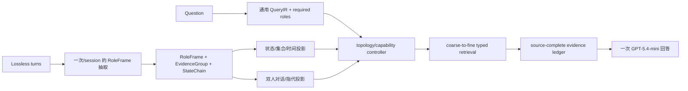

# GraphMem V4.0：统一拓扑感知混合图

## 定位

GraphMem V4.0 的正式变体名为
`hierarchical_hybrid_graph_v4_0`。它不是把 V2 与 V3.7 的答案做路由
或投票，而是用一次问题无关的构建生成一份物理事实图，再从同一组
`RoleFrame` 引用出两类能力视图：

- 状态、集合、数量、生命周期和时间视图，继承 V2 在
  LongMemEval 上有效的可计算结构。
- speaker ownership、dialogue pair、reference、same-event、邻接和
  lossless source 视图，继承 V3 系列在 LoCoMo 上有效的对话导航结构。

能力视图只保存节点 ID，不复制事实、不重复 embedding，也不作为独立
BM25 文档。最终回答始终由一次 LLM 调用产生；operator 只能生成带四项
证书的证据或计算提示。

## 单一构建和查询流程



控制器只读取持久化的对话拓扑、QueryIR 和缺失证据角色。实现中禁止读取
benchmark 名称、`question_type`、gold answer 或 gold session ID，也没有
topic 词表分支。

## V2 与 V3 系列优势如何合并

| 能力 | V2 的有效部分 | V3 系列的有效部分 | V4.0 实现 |
|---|---|---|---|
| 状态更新 | 有向状态链、latest valid state、add/remove | lossless provenance | RoleFrame 无副本状态投影，回到 source 验证 |
| 列表/数量 | collection 与通用集合代数 | EvidenceGroup 完整打包 | collection/quantity/lifecycle 联合能力 |
| 时间 | 时间锚点和确定性运算 | typed expansion | temporal projection + source endpoint |
| assistant 结果 | assistant_fact | dialogue pair | 区分用户记忆与 assistant 提供结果 |
| 双人对话 | 较弱 | 双 speaker、问答配对、reference、邻接 | peer topology 下双方均为记忆来源 |
| 防止过拟合 | V2 部分规则过多 | 通用 QueryIR/证书 | 只保留证据代数，不保留 topic/题号规则 |

## 持久化契约

标准 V3.6 物理文件继续保存 `turn / RoleFrame / RoutingCard /
EvidenceGroup`、边、状态链、倒排库和向量矩阵。V4.0 额外写入
`v4_capability_views.jsonl`，其中明确：

- 顶层 schema 为 `graphmem_v4_0`。
- 物理 role graph 的 schema 为 `graphmem_v3_6`。
- topology、speaker、能力到 frame ID 的映射。
- source coverage 和“物理重复节点数”诊断。

缓存版本为 6；指纹包含 V4 schema、V4 build version、底层抽取 prompt
hash、backbone、embedding 模型、API profile 和原始记忆 hash。V4 不会误读
V3.6 的旧缓存。

## 运行

准备仓库根目录 `.env`，至少包含 `SGAO_API_KEY` 和本地 embedding 服务所需
的鉴权配置。脚本不会打印密钥：

```bash
DATA=data/longmemeval_s_cleaned.json \
OUTDIR=runs/v4_lme \
QUESTION_WORKERS=32 \
bash scripts/run_v4_benchmark.sh
```

LoCoMo 先使用已有转换器生成统一输入，然后运行同一个脚本：

```bash
.venv/bin/python scripts/convert_locomo10.py
DATA=data/locomo10_graphmem.json \
OUTDIR=runs/v4_locomo \
QUESTION_WORKERS=64 \
bash scripts/run_v4_benchmark.sh
```

Judge 仍使用仓库已有的 Mem0 LongMemEval 和 memory-benchmarks LoCoMo
评估脚本，judge token 与 embedding token 不计入构建或回答预算。

## 预算与报告

- 每个独立 memory 构建目标/硬门槛：300K backbone token。
- 每题召回与回答目标：10K；当前允许的少数题硬上限为 12.1K。
- 输出拆分记录 cache miss input、cache hit input、completion 和 reasoning。
- reasoning 必须为 0。
- LoCoMo 的 10 组 conversation 各自只构建一次；同 conversation 的问题复用
  同一缓存，query-only 题的 build token 为 0。

## 基线与验收状态

下列是 V4.0 开发时的**回归参考线**，不是 V4.0 end-to-end 成绩：

- LongMemEval：89.0%（V2 持久化 evidence ledger + GPT-5.4-mini 重答）。
- LoCoMo Category 1–4：86.23%（V3.4 lossless-first 完整 judge）。

V4.0 必须重新构建两个 benchmark 才能产生可发布分数。在完成正式运行前，
不得把上述历史结果标为 V4.0 成绩。首轮验收至少要求：

1. 小型 mock 和静态测试全部通过。
2. 12 题跨类型 smoke 无结构/预算错误。
3. LongMemEval 与 LoCoMo 开发子集相对各自参考线无明显回退。
4. 再执行 500 题 LongMemEval 和 LoCoMo Category 1–4 全集 judge。

## 当前提交的边界

本提交提供可运行的 V4.0 单一变体、独立缓存契约、能力投影、拓扑感知查询
策略、运行脚本、测试和设计文档。它没有在提交过程中消耗外部 API 重跑两个
全集，因此没有生成新的 V4.0 准确率声明。
